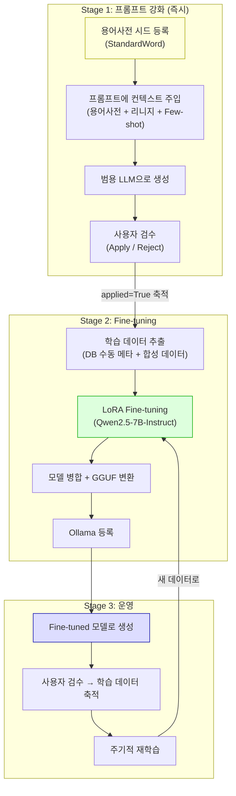
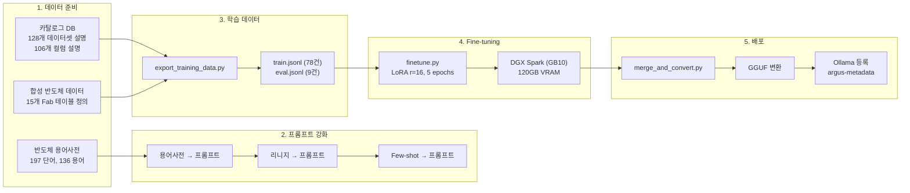
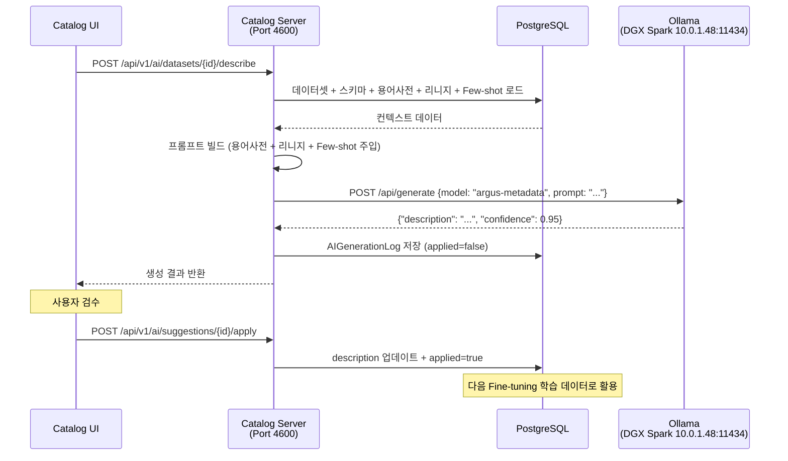

# Argus Catalog 메타데이터 AI 모델 Fine-tuning 가이드

## 1. 목적

Argus Catalog는 다양한 데이터 플랫폼(MySQL, PostgreSQL, Hive, Kafka, S3 등)의 메타데이터를 통합 관리하는 데이터 카탈로그 서비스이다. 데이터셋이 등록되면 **테이블 설명, 컬럼 설명, 태그, PII(개인정보) 분류** 등의 메타데이터를 채워야 하는데, 이를 수작업으로 수행하면 수백~수천 개의 데이터셋에 대해 막대한 시간이 소요된다.

이 프로젝트는 **LLM을 활용하여 메타데이터를 자동 생성**하고, 나아가 **고객사 데이터로 Fine-tuning된 전용 모델**을 만들어 생성 품질을 극대화하는 것을 목표로 한다.

## 2. 왜 Fine-tuning이 필요한가

### 2.1 범용 LLM의 한계

기존 AI 모듈(`app/ai/`)은 OpenAI, Anthropic, Ollama 등 범용 LLM을 호출하여 메타데이터를 생성한다. 하지만 범용 LLM은 다음과 같은 한계가 있다:

| 문제 | 예시 |
|------|------|
| **약어 해석 불가** | `eqp_stat_cd`를 보고 "장비상태코드"인지 알 수 없음 |
| **도메인 지식 부족** | 반도체 Fab의 FDC/SPC/Yield 용어를 모름 |
| **설명 스타일 불일치** | 고객사의 선호 톤/표현이 반영되지 않음 |
| **비용/레이턴시** | 외부 API 호출 비용 + 네트워크 지연 |
| **보안** | 메타데이터가 외부 API로 전송됨 (에어갭 불가) |

### 2.2 Fine-tuning으로 해결하는 것

- **도메인 특화**: 반도체/제조/금융 등 고객사 도메인의 약어, 용어, 비즈니스 맥락을 학습
- **스타일 일관성**: 고객사가 승인(Apply)한 기존 메타데이터의 톤과 디테일 수준을 학습
- **자체 서빙**: Ollama로 사내 서버에서 운영, 외부 API 의존 제거
- **비용 절감**: 추론 비용 0원 (자체 GPU 활용)

## 3. 전체 아키텍처

### 3.1 Data Flywheel (데이터 순환 구조)



### 3.2 전체 파이프라인 흐름



## 4. 수행한 작업 상세

### 4.1 반도체 용어사전 구축

**목적**: LLM이 반도체 Fab의 약어(EQP, CHMB, LOT 등)를 이해할 수 있도록 도메인 용어를 체계적으로 정리

**데이터 소스**:
- SEMI 표준 (E10 장비 상태, E30 GEM, E116 성능 추적)
- ISA-95 / IEC 62264 제조 운영 모델
- STDF V4 (반도체 테스트 표준 데이터 포맷)
- WM-811K 웨이퍼맵 데이터셋 (9개 결함 패턴)
- NIST/IC Knowledge/Lam Research/Samsung 용어집

**생성 결과**:

| 구성 요소 | 수량 | 내용 |
|-----------|------|------|
| StandardWord | 197개 | 공정(30), 장비(19), 웨이퍼/로트(22), 계측/품질(20), 레시피(16), FDC/SPC(16), 자재(10), 설비(9), 비즈니스(10), 공통접미(45) |
| StandardDomain | 33개 | 식별자(7), 명칭(2), 코드(2), 수량(4), 측정값(7종), 날짜(3), 기타(3) |
| CodeGroup | 12개 | 장비상태(E10), 로트상태, 결함유형, 공정유형, 빈유형, 웨이퍼결함패턴(WM-811K), PM유형, 홀드유형, 알람심각도, SPC판정, 웨이퍼상태, 검사유형 |
| CodeValue | 77건 | 12개 그룹의 코드값 합계 |
| StandardTerm | 136건 | 단어 조합 + 도메인 연결로 물리 컬럼명 자동 생성 |

**관련 파일**:
```
scripts/seed/semiconductor/
├── dictionary.json          # 사전 정의
├── words.json              # 단어 197건
├── domains.json            # 도메인 33건
├── code_groups.json        # 코드그룹 12개 + 코드값 77건
├── terms.json              # 용어 136건
└── seed_semiconductor.py   # API 호출 로딩 스크립트
```

**사용법**:
```bash
# 데이터 검증 (API 호출 없음)
python3 scripts/seed/semiconductor/seed_semiconductor.py --dry-run

# 카탈로그 서버에 로딩
python3 scripts/seed/semiconductor/seed_semiconductor.py --base-url http://localhost:4600
```

### 4.2 AI 프롬프트 강화

**목적**: Fine-tuning 없이도 범용 LLM의 메타데이터 생성 품질을 즉시 향상

**개선 전 프롬프트**:
```
Generate a concise description for this database table.

Table: fdc.tb_fdc_trace
Platform: postgresql
Columns:
  trc_id (BIGINT) PK NOT NULL
  lot_id (VARCHAR(30)) NOT NULL
  eqp_id (VARCHAR(30)) NOT NULL
  snr_val (DECIMAL(15,6)) NOT NULL
  ...
```

**개선 후 프롬프트**:
```
Generate a concise description for this database table.

== Terminology glossary (abbreviation → meaning) ==
  LOT: 로트 (Lot)
  EQP: 장비 (Equipment)
  SNR: 센서 (Sensor)
  TRC: 트레이스 (Trace)

== Reference examples (previously approved descriptions in this catalog) ==
  1. fdc.tb_fdc_summary: FDC 센서 데이터 요약 테이블. 로트/웨이퍼 단위로 ...
  2. mes.tb_lot_history: 로트 공정 이력. 로트가 거친 장비, 공정 단계를 ...

== Data lineage ==
  Upstream: mes.tb_lot_mst, mes.tb_equipment_mst
  Downstream: rpt.tb_fdc_alarm_daily

Table: fdc.tb_fdc_trace
Platform: postgresql
Columns:
  ...
```

**3가지 컨텍스트 소스**:

| 컨텍스트 | 소스 | 효과 |
|----------|------|------|
| **용어사전** | `catalog_standard_word` 테이블 | 약어 → 한글/영문 의미 매핑 |
| **리니지** | `argus_dataset_lineage` 테이블 | 데이터 흐름 관계 이해 |
| **Few-shot** | `catalog_ai_generation_log` (applied=True) 또는 수동 입력된 description | 설명 스타일/톤 학습 |

**관련 파일**:
- `app/ai/prompts.py` — 프롬프트 템플릿 (용어사전/리니지/Few-shot 섹션 빌더 추가)
- `app/ai/service.py` — 컨텍스트 로더 함수 3개 추가 (`_load_glossary_context`, `_load_lineage_context`, `_load_fewshot_examples`)

**핵심 설계 결정**:
- 용어사전은 **컬럼명에 실제로 등장하는 약어만** 필터링하여 토큰 효율 유지
- Few-shot은 **같은 플랫폼 타입**의 승인된 예시를 우선 선택
- 모든 컨텍스트는 **선택적** — 데이터가 없으면 빈 문자열로 처리 (하위 호환)

### 4.3 학습 데이터 추출

**목적**: 카탈로그 DB의 기존 메타데이터 + 합성 반도체 데이터를 Fine-tuning용 JSONL로 변환

**데이터 소스 2가지**:

#### 소스 1: 카탈로그 DB (42건)

| 태스크 | 건수 | 추출 기준 |
|--------|------|-----------|
| 데이터셋 설명 | 17건 | `description IS NOT NULL AND LENGTH >= 10` |
| 컬럼 설명 | 10건 | 2개 이상 컬럼에 설명이 있는 데이터셋 |
| 태그 추천 | 15건 | 1개 이상 태그가 매핑된 데이터셋 |

#### 소스 2: 합성 반도체 데이터 (45건)

15개 반도체 Fab 표준 테이블에 전문가 수준의 설명을 직접 작성:

| 테이블 | 영역 | 설명 |
|--------|------|------|
| `mes.tb_lot_mst` | MES | 로트 마스터 |
| `mes.tb_lot_hist` | MES | 로트 공정 이력 |
| `mes.tb_wf_mst` | MES | 웨이퍼 마스터 |
| `mes.tb_eqp_mst` | MES | 장비 마스터 |
| `mes.tb_eqp_state_hist` | MES | 장비 상태 이력 (SEMI E10) |
| `mes.tb_hold_hist` | MES | 홀드 이력 |
| `mes.tb_pm_hist` | MES | 예방정비 이력 |
| `mes.tb_rcp_mst` | MES | 레시피 마스터 |
| `fdc.tb_fdc_trace` | FDC | 센서 트레이스 |
| `fdc.tb_fdc_summary` | FDC | 공정 요약 |
| `fdc.tb_fdc_alarm` | FDC | FDC 알람 |
| `spc.tb_spc_data` | SPC | SPC 측정 데이터 |
| `yield.tb_wafer_sort` | Yield | 웨이퍼 소트(EDS) 결과 |
| `yield.tb_yield_summary` | Yield | 수율 요약 |
| `yield.tb_defect_map` | Yield | 결함 맵 |

각 테이블에서 3가지 태스크(description, column_description, tag_suggestion)를 생성하여 45건.

**JSONL 포맷 (ChatML)**:
```json
{
  "messages": [
    {"role": "system", "content": "You are a data catalog assistant..."},
    {"role": "user", "content": "Generate a concise description for this database table.\n\n== Terminology glossary ==\n  LOT: 로트 (Lot)\n  ...\n\nTable: mes.tb_lot_mst\nPlatform: postgresql\nColumns:\n  lot_id (VARCHAR(30)) PK NOT NULL\n  ..."},
    {"role": "assistant", "content": "{\"description\": \"로트 마스터 테이블. 반도체 Fab에서 동일 조건으로 처리되는 웨이퍼 묶음(로트)의 기본 정보를 관리한다.\", \"confidence\": 0.95}"}
  ]
}
```

**관련 파일**: `scripts/export_training_data.py`

**사용법**:
```bash
# DB에서 추출 + 합성 데이터 합산
python3 scripts/export_training_data.py --output-dir ./training_data

# DB 없이 합성 데이터만
python3 scripts/export_training_data.py --output-dir ./training_data --skip-db
```

### 4.4 LoRA Fine-tuning

**목적**: 베이스 모델(Qwen2.5-7B-Instruct)에 카탈로그 메타데이터 생성 능력을 부여

**모델 선정 이유**:

| 후보 | 한국어 | JSON 안정성 | 라이선스 | 선택 |
|------|--------|------------|---------|------|
| **Qwen2.5-7B-Instruct** | 우수 | 매우 좋음 | Apache 2.0 | **선택** |
| EXAONE-3.5-7.8B | 최우수 | 좋음 | 비상업 무료 | - |
| Llama-3.1-8B | 보통 | 좋음 | Llama License | - |

**하이퍼파라미터**:

| 파라미터 | 값 | 이유 |
|----------|-----|------|
| LoRA rank (r) | 16 | 7B 모델 대비 적절한 표현력 (40M 파라미터, 0.53%) |
| LoRA alpha | 32 | r의 2배 (일반적 권장값) |
| Target modules | q/k/v/o/gate/up/down_proj | Attention + FFN 전체 |
| Learning rate | 2e-4 | LoRA 표준 범위 |
| Epochs | 5 | 87건 소량 데이터에 적합 |
| Batch size | 2 x 4 (accum) = 8 | GPU 메모리 활용 |
| Precision | BF16 | DGX Spark 120GB VRAM으로 양자화 불필요 |
| Max seq length | 2048 | 프롬프트+응답 포함 |

**학습 결과**:

| Epoch | Train Loss | Eval Loss | Token Accuracy |
|-------|-----------|-----------|----------------|
| 1 | 0.7164 | 0.9466 | 82.0% |
| 2 | 0.4638 | 0.5934 | 90.3% |
| 3 | 0.2501 | 0.5061 | 92.4% |
| 4 | 0.1428 | 0.4862 | 92.5% |
| 5 | 0.1838 | 0.4847 | 92.6% |

- 학습 시간: **10분** (DGX Spark GB10)
- Best eval loss: **0.48** (epoch 5)
- Trainable 파라미터: **40M / 7.6B (0.53%)**

**관련 파일**: `scripts/finetune.py`

**사용법**:
```bash
python3 scripts/finetune.py \
    --base-model Qwen/Qwen2.5-7B-Instruct \
    --train-file ./training_data/train.jsonl \
    --eval-file ./training_data/eval.jsonl \
    --output-dir ./output/argus-metadata-7b-lora \
    --epochs 5 --batch-size 2 --grad-accum 4 --lora-r 16
```

### 4.5 모델 병합 & 변환

**목적**: LoRA 어댑터를 베이스 모델에 흡수하고, Ollama가 읽을 수 있는 GGUF로 변환

**과정**:
```
Qwen2.5-7B-Instruct (베이스) + LoRA adapter (checkpoint-40)
    ↓ merge_and_unload()
Merged SafeTensors (FP16, ~15GB)
    ↓ llama.cpp convert_hf_to_gguf.py
GGUF FP16 (15.2GB)
    ↓ ollama create
argus-metadata:latest (Ollama)
```

**관련 파일**: `scripts/merge_and_convert.py`

**사용법**:
```bash
# 1. LoRA 병합
python3 scripts/merge_and_convert.py \
    --base-model Qwen/Qwen2.5-7B-Instruct \
    --lora-dir ./output/argus-metadata-7b-lora/checkpoint-40 \
    --output-dir ./output/argus-metadata-7b-merged

# 2. GGUF 변환 (llama.cpp 필요)
cd /path/to/llama.cpp
python3 convert_hf_to_gguf.py \
    /path/to/argus-metadata-7b-merged \
    --outfile argus-metadata-7b-f16.gguf --outtype f16

# 3. Ollama 등록
cat > Modelfile << 'EOF'
FROM ./argus-metadata-7b-f16.gguf

SYSTEM "You are a data catalog assistant that generates metadata for database tables. Always respond with valid JSON only, no markdown fences or extra text."

PARAMETER temperature 0.3
PARAMETER num_predict 1024
PARAMETER top_p 0.9
PARAMETER stop "<|im_end|>"
PARAMETER stop "<|endoftext|>"

TEMPLATE "{{- if .System }}<|im_start|>system
{{ .System }}<|im_end|>
{{- end }}
<|im_start|>user
{{ .Prompt }}<|im_end|>
<|im_start|>assistant
{{ .Response }}<|im_end|>"
EOF

ollama create argus-metadata -f Modelfile
```

### 4.6 모델 테스트 결과

**테스트 1**: FDC 센서 트레이스 테이블

입력:
```
Table: fdc.tb_fdc_trace
Columns: trc_id, lot_id, wf_id, eqp_id, chmb_id, rcp_id, stp_id, snr_nm, snr_val, collect_dtm
```

출력:
```json
{
  "description": "FDC 센서 값 트레이스 테이블. FDC 시스템에서 수집된 센서값을 로트/웨이퍼 단위로 추적한다.",
  "confidence": 0.95
}
```

**테스트 2**: 웨이퍼 소트 결과 테이블

입력:
```
Table: yield.tb_wafer_sort
Columns: wf_id, die_x, die_y, lot_id, prd_id, hard_bin, soft_bin, pass_yn, test_pgm, test_dtm
```

출력:
```json
{
  "description": "웨이퍼 소트 결과 테이블. 웨이퍼 단위로 DICE 검사 및 소팅 결과를 기록한다. 웨이퍼 ID, DIE 좌표, 로트 ID, 제품 ID, 하드웨어/소프트웨어 빈, 패스/노패 여부, 테스트 프로그램 및 검사 일시를 포함한다.",
  "confidence": 0.95
}
```

## 5. Catalog Server 연동

Fine-tuning된 모델은 **코드 변경 없이** 기존 Catalog Server의 AI 모듈과 연동된다.

### 5.1 설정 변경

UI의 Settings → LLM/AI 탭 또는 DB에서 직접 변경:

```sql
UPDATE catalog_configuration SET value = 'ollama'          WHERE key = 'llm_provider';
UPDATE catalog_configuration SET value = 'argus-metadata'  WHERE key = 'llm_model';
UPDATE catalog_configuration SET value = 'http://10.0.1.48:11434' WHERE key = 'llm_api_url';
UPDATE catalog_configuration SET value = 'true'            WHERE key = 'llm_enabled';
```

### 5.2 동작 흐름



### 5.3 기존 Provider와의 비교

기존 `app/ai/providers/ollama.py`가 그대로 동작하며, 모델명만 변경:

```
기존: llm_model = "llama3.1"          → 범용 모델
변경: llm_model = "argus-metadata"    → Fine-tuned 모델
```

## 6. 인프라 환경

### 6.1 Fine-tuning 서버

| 항목 | 사양 |
|------|------|
| 서버 | DGX Spark (`10.0.1.48`) |
| GPU | NVIDIA GB10 (120GB unified memory) |
| CPU | Grace (ARM aarch64), 20코어 |
| RAM | 128GB |
| 디스크 | 1.9TB NVMe (673GB 가용) |
| OS | Ubuntu 24.04 LTS |
| Ollama | 0.13.0 |

### 6.2 학습 환경

```
Python 3.12.3
PyTorch 2.11.0+cu130
transformers 5.3.0
peft 0.18.1
trl 0.29.1
datasets 4.8.4
accelerate 1.13.0
```

## 7. 파일 목록

```
argus-catalog-server/
├── app/ai/
│   ├── prompts.py                  # 프롬프트 템플릿 (용어사전/리니지/Few-shot 섹션 추가)
│   ├── service.py                  # AI 서비스 (컨텍스트 로더 3개 추가)
│   ├── providers/ollama.py         # Ollama 프로바이더 (변경 없음)
│   ├── models.py                   # AIGenerationLog ORM
│   └── router.py                   # AI API 엔드포인트
├── scripts/
│   ├── seed/semiconductor/
│   │   ├── dictionary.json         # 반도체 표준사전 정의
│   │   ├── words.json              # 표준 단어 197건
│   │   ├── domains.json            # 표준 도메인 33건
│   │   ├── code_groups.json        # 코드 그룹 12개 + 코드값 77건
│   │   ├── terms.json              # 표준 용어 136건
│   │   └── seed_semiconductor.py   # 시드 데이터 로딩 스크립트
│   ├── export_training_data.py     # 학습 데이터 추출 (DB + 합성 데이터)
│   ├── finetune.py                 # LoRA Fine-tuning 스크립트
│   └── merge_and_convert.py        # 모델 병합 + SafeTensors 저장
└── fine-tuning.md                  # 이 문서
```

## 8. 재학습 (Continuous Improvement)

### 8.1 재학습 트리거 조건

- 새로 축적된 `applied=True` 데이터가 이전 학습 대비 **+50건 이상**
- 고객사의 **새로운 도메인 테이블**이 대량 등록됨
- 모델 생성 품질에 대한 **Reject 비율이 30% 이상**

### 8.2 재학습 절차

```bash
# 1. 최신 학습 데이터 추출
python3 scripts/export_training_data.py --output-dir ./training_data_v2

# 2. Fine-tuning (이전 모델이 아닌 베이스 모델에서 다시 학습)
python3 scripts/finetune.py \
    --train-file ./training_data_v2/train.jsonl \
    --eval-file ./training_data_v2/eval.jsonl \
    --output-dir ./output/argus-metadata-7b-lora-v2

# 3. 병합 + GGUF 변환 + Ollama 재등록
python3 scripts/merge_and_convert.py --lora-dir ./output/argus-metadata-7b-lora-v2/checkpoint-best
# ... (GGUF 변환 + ollama create)
```

### 8.3 고객사별 모델 관리

각 고객사는 자체 데이터로 별도 모델을 학습하여 독립 운영:

```
고객사 A (제조): argus-metadata-mfg    → 반도체 MES/FDC/SPC 특화
고객사 B (금융): argus-metadata-fin    → 금융 거래/계좌/리스크 특화
고객사 C (공공): argus-metadata-gov    → 공공 민원/예산/인사 특화
```

## 9. 관련 커밋

| 커밋 | 내용 |
|------|------|
| `c9f03fc32` | Add semiconductor manufacturing standard dictionary seed data |
| `0af289a75` | Enhance AI prompts with glossary, lineage, and few-shot context |
| `0e0534542` | Add fine-tuning pipeline scripts for catalog metadata AI model |
